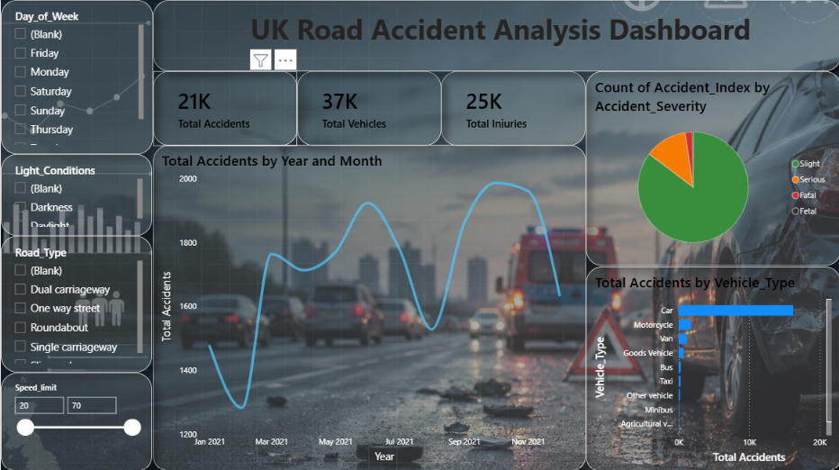

# 🚗 UK Road Accident Analysis Dashboard – Power BI

Interactive UK Road Accident Analysis Dashboard developed entirely using Microsoft Power BI and Power Query.

## 🛠️ Tools & Technologies

- Microsoft Power BI
- Power Query
- DAX
- Data Visualization

## 📊 Dashboard Features

- Total Accident Analysis
- Total Vehicles
- Total Injuries
- Accident Severity Analysis
- Accidents by Year and Month
- Vehicle Type Analysis
- Road Type Analysis
- Light Conditions
- Speed Limit Analysis
- Interactive Filters and Slicers

## 🖼️ Dashboard Preview

## 🎯 Objective

To analyze UK road accident data and identify patterns based on accident severity, vehicle type, road conditions, time, and other factors using interactive Power BI visualizations.

## 📂 Project File

The `.pbix` file contains the complete Power BI dashboard, data transformation and analysis.

## 📌 Data Preparation

Data cleaning and transformation were performed using Power Query within Power BI.
